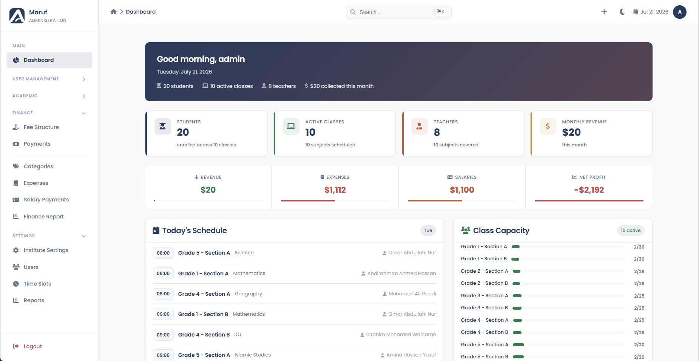

# IMS - Institute Management System

A comprehensive, web-based management system for educational institutes. Built with PHP, MySQL, and a custom design system with dark mode support.



## Features

### Academic Management

- **Classes** - Create, edit, and schedule classes with subjects, teachers, time slots, and days
- **Subjects** - Manage curriculum subjects (Mathematics, English, Science, etc.)
- **Teachers** - Add and manage teacher profiles with qualifications and specializations
- **Teacher Subjects** - Assign teachers to subjects they teach
- **Scheduling** - View per-class schedules and a master schedule across all classes

### Student Management

- **Enrollment** - Register students and assign them to active classes
- **Transfers** - Move students between classes with reassignment tracking
- **Lifecycle** - Mark students as graduated, suspended, or dropped (with restore option)

### Finance

- **Fee Structures** - Define fee types (monthly, quarterly, yearly, one-time) with amounts and penalties
- **Fee Payments** - Record payments with multiple methods (cash, card, bank transfer, online)
- **Receipts** - Generate and print payment receipts
- **Expense Tracking** - Log expenses by category (rent, utilities, supplies, etc.)
- **Salary Payments** - Record and track teacher salary disbursements
- **Finance Report** - Revenue vs. expenses overview with filtering

### Dashboard & Reporting

- **Overview** - Stats cards for active classes, students, teachers, revenue, expenses, and net profit
- **Revenue vs Expenses** - 6-month bar chart visualization
- **Recent Activity** - Latest payments and expenses at a glance
- **Reports** - Institution-wide analytics

### System Features

- **Dark Mode** - Toggle between light and dark themes (persisted via localStorage)
- **Global Search** - `Ctrl+K` / `Cmd+K` shortcut to search across students, teachers, classes, and payments
- **Quick Add** - Dropdown menu for creating common records from any page
- **Responsive Design** - Mobile-friendly sidebar with overlay
- **Configurable** - Institute name, logo, and contact info via Settings

## Tech Stack

| Layer | Technology |
|-------|-----------|
| Backend | PHP 7.4+ |
| Database | MySQL 5.7+ (PDO) |
| Frontend | HTML5, Custom CSS Design System |
| Icons | Font Awesome 6.4 |
| Fonts | Google Fonts (Poppins) |
| Server | Apache (XAMPP) |

## Prerequisites

- [XAMPP](https://www.apachefriends.org/) (or any Apache + MySQL stack)
- PHP 7.4 or higher
- MySQL 5.7 or higher

## Installation

**1. Clone the repository**

```bash
git clone <repository-url>
```

**2. Move to web server root**

```bash
# XAMPP on Windows
xcopy /E /I <clone-path>\SchoolFinance C:\xampp\htdocs\SchoolFinance
```

**3. Create the database**

```bash
"C:\xampp\mysql\bin\mysql.exe" -u root < C:\xampp\htdocs\SchoolFinance\database.sql
```

**4. Configure database credentials**

Edit `config.php` if your MySQL setup differs from the defaults:

```php
define('DB_HOST', 'localhost');
define('DB_NAME', 'english_institute');
define('DB_USER', 'root');
define('DB_PASS', '');
```

**5. Start services**

Open XAMPP Control Panel and start **Apache** and **MySQL**.

**6. Access the application**

```
http://localhost/SchoolFinance/
```

### Default Credentials

| Field | Value |
|-------|-------|
| Username | `admin` |
| Password | `admin123` |

> Change the default password after first login via the Users page.

## Database Schema

```
users                  Admin accounts and authentication
teachers               Teacher profiles (name, qualifications, salary)
subjects               Curriculum subjects
teacher_subjects       Teacher-to-subject assignments (M:N)
classes                Class groups (name, dates, capacity)
class_subjects         Class timetable entries (subject + teacher + day + time slot)
students               Student records with guardian info
student_enrollments    Student-to-class enrollment tracking
student_reassignments  Transfer history between classes
fee_structures         Fee definitions (type, amount, penalties)
fee_payments           Payment records with method tracking
student_fees           Per-student fee ledger
expense_categories     Expense classification
expenses               Expense records
salary_payments        Teacher salary disbursement log
time_slots             Available time slots (08:00-21:00)
days                   Days of the week
settings               Institute configuration key-value store
```

## Project Structure

```
SchoolFinance/
├── config.php              Database connection, auth helpers, settings
├── database.sql            Full schema with seed data
├── index.php               Dashboard
├── login.php               Admin login page
├── logout.php              Session destruction
├── header.php              Sidebar navigation & page header
├── footer.php              Scripts (theme, search, mobile menu)
├── search.php              AJAX global search endpoint
│
├── css/
│   └── design-system.css   Custom CSS variables, components, dark mode
│
├── teachers.php            Teacher list & management
├── teacher_create.php      Add new teacher
├── teacher_edit.php        Edit teacher details
├── teacher_subjects.php    Assign teachers to subjects
├── students.php            Student list & enrollment
│
├── classes.php             Class list
├── class_create.php        Create new class
├── class_edit.php          Edit class details
├── class_view.php          Class detail view
├── class_delete.php        Delete class with cascade
├── class_schedule.php      Per-class schedule view
├── master_schedule.php     Institution-wide timetable
├── subjects.php            Subject management
│
├── fee_structures.php      Fee type definitions
├── fee_payments.php        Record fee payments
├── receipt.php             Print payment receipts
├── expense_categories.php  Expense category management
├── expenses.php            Expense recording
├── salary_payments.php     Teacher salary payments
├── finance_report.php      Financial reports & filtering
│
├── timeslots.php           Time slot management
├── settings.php            Institute settings (name, logo)
├── users.php               Admin user management
├── reports.php             Analytics & reports
│
├── uploads/                File uploads (logos, etc.)
└── vendor/                 Composer dependencies (if any)
```

## Configuration

### Institute Branding

Navigate to **Settings** after login to configure:

- Institute name (displayed in sidebar and login page)
- Logo (uploaded to `uploads/`)
- Contact email, phone, and address

### Database

All database configuration lives in `config.php`. The application uses PDO with:

- `ERRMODE_EXCEPTION` for error handling
- `FETCH_ASSOC` as default fetch mode
- Native prepared statements (emulation disabled)

## Contributing

1. Fork the repository
2. Create a feature branch (`git checkout -b feature/amazing-feature`)
3. Commit your changes (`git commit -m "Add amazing feature"`)
4. Push to the branch (`git push origin feature/amazing-feature`)
5. Open a Pull Request

## License

This project is open source and available under the [MIT License](LICENSE).
